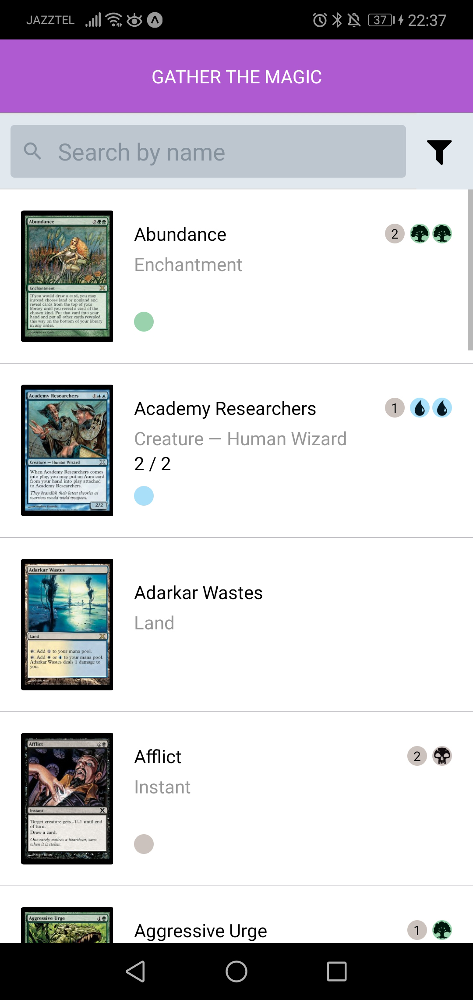
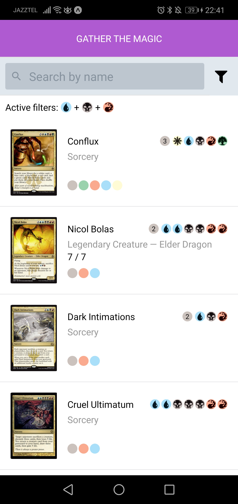
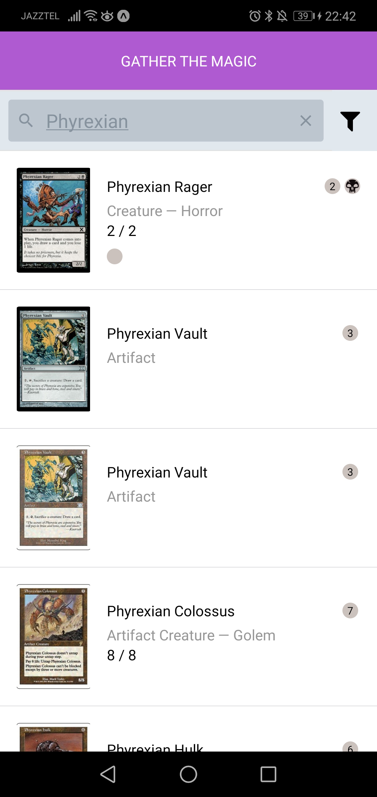
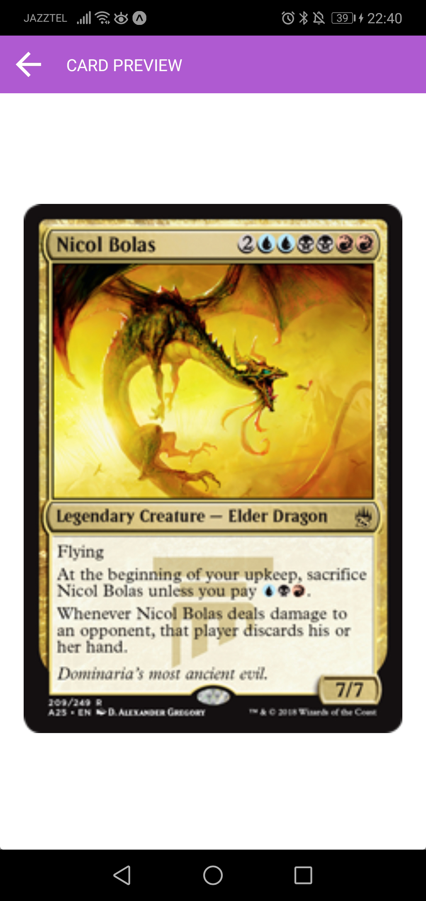

# Gather the magic App

Welcome everyone to Gather the Magic!

This simple app uses the magnificent Magic the Gathering API: https://api.magicthegathering.io/ to list
all the game cards.

## But... what does it actually do?

* If no option is selected, it will fetch all the game cards that contain a multiverseId (all that are present at http://gatherer.wizards.com/) ordered alphabetically,
* You can filter cards by name using the top search bar.
* Also, by clicking on the filter icon you can filter the cards by color (do not mistake with the mana cost colors).
* ... aaaand if you click an item from the list, a full screen preview of the card will be shown.






```
Isn't this just PURE MAGIC?
```

NOTE: In order to make the experience smooth, this app stores every server request so that subsecuent queries will fetch the data from the store instead of
making another async request to the API. Thus rendering the content much faster. This storage is reset everytime the app is open.


## Installing

### Prerequisites

You must install yarn and expo-cli globally

```
npm install -g yarn
npm install -g expo-cli
```
NOTE: You may need to sudo the global installs


### Run the development server

Get into the project directory an run:

```
yarn install
```

Wait untill all modules are installed and then start the expo local development server:


```
yarn start
```
or

```
expo start
```

### Open the project with the Expo client app on iOS or Android, or in your web browser

To run the app we don’t need to build any native code because it runs in the Expo client, and the CLI will automatically install it for us in the iOS simulator or on any connected Android emulator or device. You can also download it from the App Store and Play Store.

For more details on how to use expo client check the docs: https://docs.expo.io/versions/latest/
